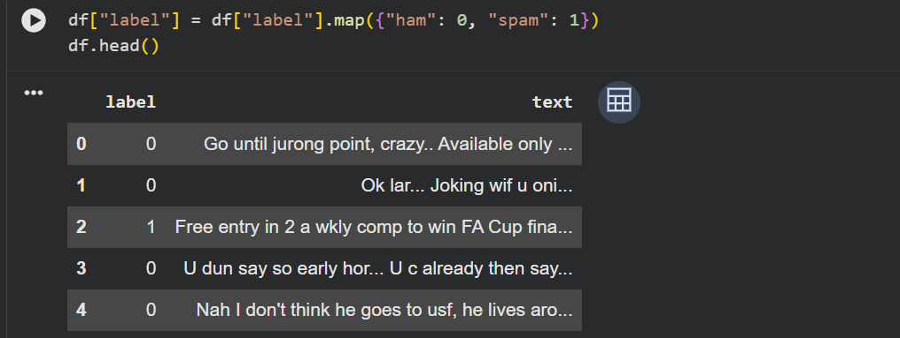

# Spam vs Ham Classifier (Python)

A simple AI project that classifies text messages as spam or not spam using a machine learning model.

## Demo

## How to Run

1. Open `spam_classifier.ipynb` in Google Colab  
2. Run all the cells  
3. Type a message to see if it’s Spam or Not Spam  
4. Type `exit` to stop
